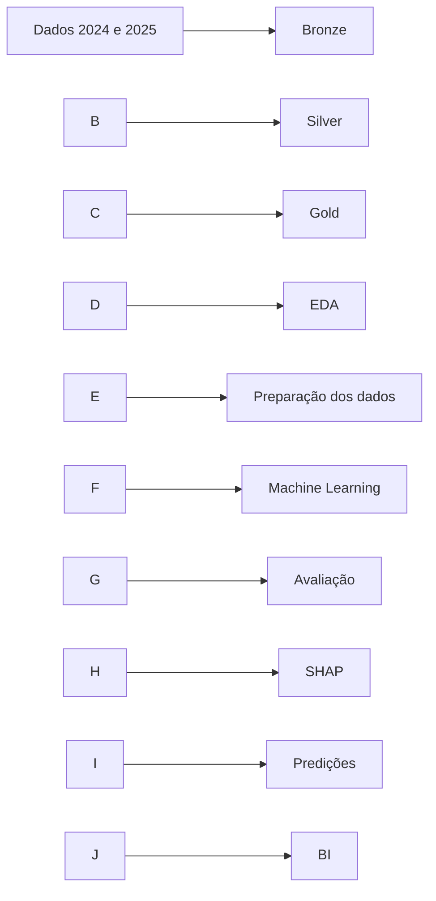

# 📊 Tech Challenge — Fase 3

## Predição e Inteligência Analítica para Alfabetização no Brasil

!\[Databricks](https://img.shields.io/badge/Databricks-FF3621?style=for-the-badge\&logo=databricks\&logoColor=white)
!\[Apache Spark](https://img.shields.io/badge/Apache\_Spark-E25A1C?style=for-the-badge\&logo=apache-spark\&logoColor=white)
!\[Python](https://img.shields.io/badge/Python-3776AB?style=for-the-badge\&logo=python\&logoColor=white)
!\[Scikit-learn](https://img.shields.io/badge/Scikit--learn-F7931E?style=for-the-badge\&logo=scikitlearn\&logoColor=white)
!\[XGBoost](https://img.shields.io/badge/XGBoost-ML-red?style=for-the-badge)
Video Explicativo: https://youtu.be/bGx7iJCZQY4

\---

## 1\. Contexto do problema

A alfabetização infantil é um dos principais indicadores do desenvolvimento educacional brasileiro.

Na Fase 2 do Tech Challenge foi construída uma pipeline de engenharia de dados responsável pelo processamento das informações educacionais de 2024 e 2025 utilizando as camadas Bronze, Silver e Gold.

Na Fase 3, os dados tratados na camada Gold são utilizados para análise exploratória e desenvolvimento de modelos de Machine Learning capazes de prever se um aluno será classificado como alfabetizado ou não alfabetizado.

\---

## 2\. Objetivo

O objetivo principal é desenvolver uma solução de Machine Learning para prever a variável:

```text
in\_alfabetizado
```

Onde:

```text
0 = Não Alfabetizado
1 = Alfabetizado
```

O projeto contempla:

* análise exploratória dos dados;
* preparação das variáveis;
* tratamento das informações antes da modelagem;
* pipeline de preprocessing;
* treinamento e comparação de modelos;
* otimização do melhor modelo;
* avaliação das métricas;
* interpretação das previsões com SHAP;
* geração de scores de risco;
* disponibilização dos resultados para análise em BI.

\---

## 3\. Estrutura do projeto

```text
tech-challenge-fase3/
│
├── bronze/
│   ├── bronze.py
│   └── bronze.sql
│
├── dashboard/
│
├── eda/
│   └── eda.py
│
├── gold/
│   ├── gold.py
│   └── gold.sql
│
├── ML/
│   │
│   ├── data/
│   │   └── power\_bi/
│   │       ├── dim\_estados\_ibge.csv
│   │       ├── gold\_metricas\_modelos.csv
│   │       └── gold\_predicoes\_risco.csv
│   │
│   ├── images/
│   │   ├── curva\_roc.png
│   │   ├── matriz\_confusao.png
│   │   └── shap\_summary.png
│   │
│   ├── models/
│   │   └── modelo\_alfabetizacao.joblib
│   │
│   └── ML.py
│
├── silver/
│   └── silver.py
│
├── streaming/
│   └── streaming.py
│
└── README
```

\---

## 4\. Arquitetura

O projeto mantém a Arquitetura Medalhão desenvolvida na Fase 2 e adiciona a etapa de Machine Learning.



Fluxo principal:

```text
Bronze
   ↓
Silver
   ↓
Gold
   ↓
EDA
   ↓
Preprocessing
   ↓
Machine Learning
   ↓
Avaliação
   ↓
Predições
   ↓
BI
```

\---

## 5\. Base utilizada

O projeto utiliza dados educacionais referentes aos anos:

```text
2024
2025
```

As principais entidades processadas são:

```text
aluno
municipio
estado
item
```

A principal tabela utilizada pelo Machine Learning é:

```text
workspace.default.gold\_aluno
```

Também são utilizados indicadores municipais da tabela:

```text
workspace.default.gold\_indicador\_municipio
```

A camada Gold possui ainda:

```text
gold\_indicador\_estado
gold\_indicador\_brasil
gold\_indicador
gold\_referencia\_municipio
```

\---

## 6\. Engenharia de dados

### Bronze

A camada Bronze consolida os dados de 2024 e 2025 e adiciona informações de rastreabilidade:

```text
dt\_ingestao
origem
```

São geradas:

```text
bronze\_aluno
bronze\_municipio
bronze\_estado
bronze\_item
```

### Silver

A camada Silver realiza:

* padronização dos nomes das colunas;
* remoção de duplicados;
* tratamento dos campos de texto;
* análise de valores nulos;
* filtro de alunos presentes;
* remoção de registros sem proficiência em Língua Portuguesa.

Para os alunos são aplicadas as regras:

```text
in\_presenca\_lp = 1
vl\_proficiencia\_lp não pode ser nulo
```

### Gold

A camada Gold integra as informações de alunos, municípios e estados.

São geradas:

```text
gold\_aluno
gold\_indicador\_municipio
gold\_indicador\_estado
gold\_indicador\_brasil
gold\_indicador
gold\_referencia\_municipio
```

Os principais indicadores calculados são:

```text
total\_alunos
alunos\_com\_classificacao
media\_proficiencia\_lp
percentual\_alfabetizados
percentual\_nao\_alfabetizados
```

Também são calculadas variações entre os anos disponíveis.

\---

## 7\. Análise Exploratória dos Dados

A análise exploratória é realizada pelo arquivo:

```text
eda/eda.py
```

Foram avaliados:

* quantidade de registros;
* quantidade de colunas;
* distribuição da variável alvo;
* valores nulos;
* distribuição da presença.

A tabela `gold\_aluno` possui:

```text
3.818.457 registros
14 colunas
```

### Distribuição do target

```text
Não Alfabetizados: 36,88%
Alfabetizados:     63,12%
```

### Valores nulos

Foram identificados:

```text
510 valores nulos em id\_escola
```

dentro de uma base com mais de 3,8 milhões de registros.

### Presença

Todos os registros utilizados possuem:

```text
in\_presenca\_lp = 1
```

Isso ocorre porque a camada Silver mantém somente alunos presentes na avaliação.

\---

## 8\. Preparação para Machine Learning

O problema é tratado como uma classificação binária supervisionada.

Target:

```text
in\_alfabetizado
```

Antes do treinamento, são removidas variáveis que não devem participar diretamente da predição, como:

```text
vl\_proficiencia\_lp
status\_alfabetizacao
media\_proficiencia\_lp
percentual\_alfabetizados
percentual\_nao\_alfabetizados
id\_aluno
in\_presenca\_lp
status\_presenca\_lp
```

As variáveis restantes são separadas entre numéricas e categóricas.

\---

## 9\. Pipeline de preprocessing

O preprocessing é integrado ao modelo utilizando:

```text
ColumnTransformer
Pipeline
```

### Variáveis numéricas

São utilizadas:

```text
SimpleImputer(strategy="median")
StandardScaler()
```

### Variáveis categóricas

São utilizadas:

```text
SimpleImputer(strategy="most\_frequent")
TargetEncoder()
```

O campo `id\_escola` é tratado como variável categórica durante a preparação.

\---

## 10\. Amostragem e divisão dos dados

A base possui mais de 3,8 milhões de registros.

Para reduzir o consumo de memória durante o treinamento, o código realiza amostragem estratificada de aproximadamente:

```text
250.000 registros
```

mantendo a proporção entre alfabetizados e não alfabetizados.

Posteriormente, os dados são separados aproximadamente em:

```text
70% treino
15% validação
15% teste
```

A separação utiliza estratificação pela variável alvo e:

```text
random\_state = 42
```

\---

## 11\. Modelos utilizados

O projeto compara três algoritmos:

```text
Logistic Regression
Random Forest
XGBoost
```

### Logistic Regression

Utilizada como modelo inicial de referência.

### Random Forest

Utilizada para capturar relações não lineares entre as variáveis.

### XGBoost

Utilizado como modelo baseado em Gradient Boosting para comparação de desempenho.

Os três modelos passam pelo mesmo processo de preparação dos dados.

\---

## 12\. Escolha e otimização do modelo

Durante a validação são calculadas:

```text
Accuracy
F1-score
F1-Macro
ROC-AUC
Recall da classe Não Alfabetizado
```

O melhor modelo inicial é escolhido com base no:

```text
ROC-AUC
```

Depois da seleção, é realizada otimização de hiperparâmetros utilizando:

```text
RandomizedSearchCV
```

com validação:

```text
StratifiedKFold
```

O projeto também testa diferentes limiares de decisão para melhorar a identificação da classe:

```text
0 = Não Alfabetizado
```

\---

## 13\. Avaliação do modelo

A avaliação final utiliza o conjunto de teste, que permanece separado das etapas de treinamento.

São utilizadas:

```text
Accuracy
Precision
Recall
F1-score
ROC-AUC
Matriz de Confusão
Curva ROC
```

O projeto gera automaticamente:

```text
ML/images/matriz\_confusao.png
ML/images/curva\_roc.png
```

As métricas comparativas dos modelos são exportadas para:

```text
ML/data/power\_bi/gold\_metricas\_modelos.csv
```

\---

## 14\. Interpretabilidade

O projeto utiliza SHAP para analisar a influência das variáveis sobre as previsões do modelo.

É gerado:

```text
ML/images/shap\_summary.png
```

O gráfico permite visualizar quais características apresentam maior influência sobre as decisões do modelo.

Essa etapa complementa as métricas tradicionais ao permitir interpretar o comportamento do modelo.

\---

## 15\. Predições e análise de risco

Após o treinamento, o modelo gera para os registros do conjunto de teste:

```text
in\_alfabetizado\_real
in\_alfabetizado\_pred
score\_prob
cluster\_risco
```

O `score\_prob` representa a probabilidade calculada pelo modelo.

Os resultados também recebem uma classificação:

```text
Alto
Medio
Baixo
```

Os dados são exportados para:

```text
ML/data/power\_bi/gold\_predicoes\_risco.csv
```

e também podem ser gravados no Databricks em:

```text
workspace.default.gold\_predicoes\_risco\_ml
```

\---

## 16\. Insights encontrados

A análise realizada até o momento permitiu identificar:

* predominância de alunos classificados como alfabetizados na base;
* aproximadamente 63,12% dos registros pertencem à classe alfabetizado;
* aproximadamente 36,88% pertencem à classe não alfabetizado;
* a base possui poucos valores ausentes em relação ao volume total;
* `in\_presenca\_lp` não apresenta variação na Gold utilizada;
* existem informações territoriais, administrativas e escolares que podem ser utilizadas pelo modelo;
* a interpretação das variáveis mais relevantes é realizada através do SHAP.

\---

## 17\. Aplicação prática

A solução permite transformar os dados educacionais históricos em uma análise preditiva.

As probabilidades geradas pelo modelo podem apoiar:

* identificação de registros com maior risco de não alfabetização;
* análise territorial dos resultados;
* análise por município e estado;
* comparação dos indicadores educacionais;
* identificação das variáveis com maior influência sobre as previsões;
* apoio analítico à tomada de decisão relacionada à alfabetização.

\---

## 18\. Camada de consumo e BI

O processo de Machine Learning gera arquivos preparados para consumo em ferramentas de análise:

```text
ML/data/power\_bi/
├── dim\_estados\_ibge.csv
├── gold\_metricas\_modelos.csv
└── gold\_predicoes\_risco.csv
```

A dimensão de estados é obtida através da API de localidades do IBGE e contém informações como:

```text
co\_uf
sg\_uf
no\_uf
regiao\_nome
```

Essa camada permite utilizar métricas, previsões e informações territoriais no dashboard.

\---

## 19\. Modelo treinado

Após o treinamento e otimização, o modelo é salvo em:

```text
ML/models/modelo\_alfabetizacao.joblib
```

Isso permite armazenar o pipeline treinado para reutilização posterior.

\---

## 20\. Tecnologias utilizadas

|Tecnologia|Utilização|
|-|-|
|Databricks|desenvolvimento e processamento|
|Apache Spark|processamento distribuído|
|PySpark|engenharia de dados|
|Delta Lake|armazenamento das tabelas|
|Python|desenvolvimento do Machine Learning|
|Pandas|preparação dos dados para modelagem|
|NumPy|operações numéricas|
|Scikit-learn|preprocessing, pipeline, modelos e métricas|
|Logistic Regression|modelo de classificação|
|Random Forest|modelo de classificação|
|XGBoost|modelo de classificação|
|SHAP|interpretação das previsões|
|Matplotlib|visualizações|
|Seaborn|visualizações|
|Joblib|armazenamento do modelo|
|IBGE API|dimensão territorial auxiliar|

\---

## 21\. Como executar

Executar primeiro a pipeline de dados:

```text
1. bronze/bronze.py
2. silver/silver.py
3. gold/gold.py
```

Executar a análise exploratória:

```text
4. eda/eda.py
```

Executar o Machine Learning:

```text
5. ML/ML.py
```

O arquivo de Streaming pode ser executado separadamente:

```text
streaming/streaming.py
```

O fluxo do Machine Learning é:

```text
Carregamento da Gold
        ↓
Preparação das features
        ↓
Amostragem
        ↓
Treino / Validação / Teste
        ↓
Preprocessing
        ↓
Logistic Regression
Random Forest
XGBoost
        ↓
Comparação
        ↓
Otimização
        ↓
Avaliação
        ↓
SHAP
        ↓
Predições
        ↓
Camada de consumo para BI
```

\---

## 22\. Conclusão

A Fase 3 amplia o projeto desenvolvido anteriormente ao utilizar os dados tratados na camada Gold para construção de uma solução preditiva.

A solução contempla análise exploratória, preparação dos dados, pipeline de preprocessing, treinamento e comparação de modelos, otimização, avaliação e interpretação das previsões.

Foram implementados três algoritmos:

```text
Logistic Regression
Random Forest
XGBoost
```

Além das métricas tradicionais, o projeto utiliza SHAP para analisar a influência das variáveis e gera uma camada de predições preparada para análise em BI.

Dessa forma, o projeto evolui de uma arquitetura focada no processamento e análise histórica dos dados para uma solução de Machine Learning aplicada ao contexto da alfabetização no Brasil.

